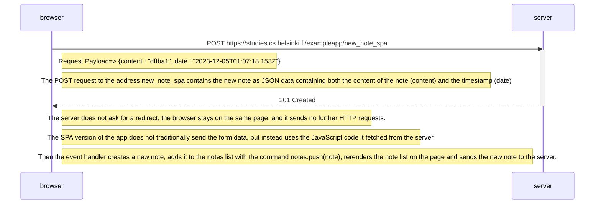

```mermaid
sequenceDiagram
participant browser
participant server

browser->>server: POST https://studies.cs.helsinki.fi/exampleapp/new_note_spa
activate server
Note right of browser: Request Payload=> {content : "dftba1", date : "2023-12-05T01:07:18.153Z"}
Note right of browser: The POST request to the address new_note_spa contains the new note as JSON data containing both the content of the note (content) and the timestamp (date)
server-->>browser: 201 Created
deactivate server
Note right of browser: The server does not ask for a redirect, the browser stays on the same page, and it sends no further HTTP requests.
Note right of browser: The SPA version of the app does not traditionally send the form data, but instead uses the JavaScript code it fetched from the server.
Note right of browser: Then the event handler creates a new note, adds it to the notes list with the command notes.push(note), rerenders the note list on the page and sends the new note to the server.
```
